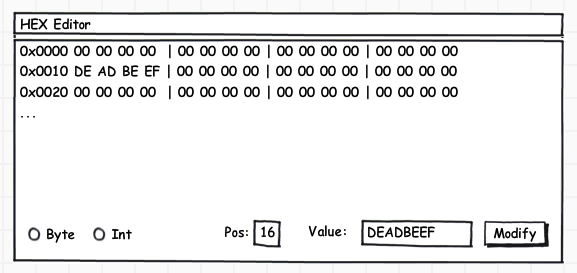
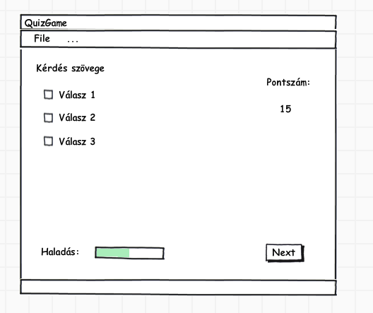

# GUI Kiegészítés #

## Listenerek egyéb megvalósításai##
Saját listener megvalósítása:

``` java
public class GUI1 {
	private final JButton ok = new JButton("Ok");

	private class OkButtonActionListener implements ActionListener {
		@Override
		public void actionPerformed(ActionEvent e) {
			System.out.println("Ok pressed");
		}
	}

	public GUI1() {
		OkButtonActionListener listener = new OkButtonActionListener();
		ok.addActionListener(listener);
	}
}
```

vagy maga az osztály implementálja az interfészt, mindenre rá lehet aggatni,
majd `setActionCommand()` ill. `getActionCommand()` függvény használható a
megkülönböztetésre:

``` java
public class GUI2 implements ActionListener {
	private final JButton ok = new JButton("Ok");
	private final JButton cancel = new JButton("Ok");

	private final String OK_COMMAND     = "ok";
	private final String CANCEL_COMMAND = "cancel";

	public GUI2() {
		ok.addActionListener(this);
		ok.setActionCommand(OK_COMMAND);

		cancel.addActionListener(this);
		cancel.setActionCommand(CANCEL_COMMAND);
	}

	public void actionPerformed(ActionEvent e) {
		if (OK_COMMAND.equals(e.getActionCommand())) {
			System.out.println("Ok pressed");
		} else if (CANCEL_COMMAND.equals(e.getActionCommand())) {
			System.out.println("Cancel pressed");
		}
	}
}
```

## Komplexebb grafikus felület##
Containerekkel (`Panel`, `JPanel`).

TODO: kép

## JOptionPane ##
Ha `super != null`, akkor modális, pl.:

``` java
JFrame frame = ...;
...
JOptionPane.showMessageDialog( frame, "Modalis uzenet");
```

## MVC ##
Model-View-Controller. Egyes GUI komponensek nem direkt módon tárolják az
adatokat (többféle reprezentáció), ilyenkor modelleket kell használni (pl.
`JProgressBar`, `JNumberSpinner`, `JTable`, stb.). Példa:

``` java
int val = progressBar.getModel().getValue();
progressBar.getModel().setValue(++val);
```

## BorderLayout ##
Használatra példa:

``` java
JPanle panel = new JPanel( new BorderLayou() );

panel.add( new JLabel("North"),  BorderLayout.NORTH  );
panel.add( new JLabel("South"),  BorderLayout.SOUTH  );
panel.add( new JLabel("East"),   BorderLayout.EAST   );
panel.add( new JLabel("West"),   BorderLayout.WEST   );
panel.add( new JLabel("Center"), BorderLayout.CENTER );
```

## CardLayout ##
Példa:

``` java
final static String APANEL = "Panel 1";
final static String BPANEL = "Panel 2";

JPanel card1 = new JPanel();
JPanel card2 = new JPanel();

CardLayoult layout = new new CardLayout();
cards = new JPanel( layout );
cards.add(card1, APANEL);
cards.add(card2, BPANEL);

layout.show(cards, APANEL );
layout.show(cards, BPANEL );

layout.first(cards);
layout.last(cards);
```

## JRadioButton##
`ButtonGroup` használata kell, ha szeretnénk, hogy egyszerre csak választható ki közülük:

``` java
JRadioButton button1 = new JRadioButton("A");
JRadioButton button2 = new JRadioButton("B");

ButtonGroup group = new ButtonGroup();
group.add( button1 );
group.add( button2 );
```

## JFileChooser ##
Használatnál figyeljünk a visszatérési értékre!

``` java
final JFileChooser fc = new JFileChooser();
...
int ret = fc.showOpenDialog( frame );
if ( JFileChooser.APPROVE_OPTION == ret ) {
	...
}
```

## Feladatok ##
### Hex editor ###
Készíts egy egyszerű hexadecimális szövegszerkesztőt! Egy sorban 16 karakter
legyen, amely az egyes bájtok értékeit reprezentálják. A program kínáljon
lehetőséget `byte`, `int` módosításra, adott pozíción, megadott értékkel. A 
szövegmezőn keresztüli szerkesztés legyen letiltva (`setEnabled(false)`). Ha
megnyomják a modify gombot, akkor az adott értéket írjuk ki a file-ba
(`RandomAccessFile` segítségével) a megadott pozícióra, és frissítsük a
szövegmező tartalmát!


**Képernyőterv** - Hex editor

### Kvíz alkalmazás ###
Készítsünk egy egyszerű kvíz-alkalmazást, amely az alábbi típusú kérdéseket
tartalmazhatja:

* Eldöntendő kérdés, pl.:

		Hány fia volt Ádámnak a Biblia szerint?
		( ) 2
		( ) 3
		(*) 33

* Kiválasztós, pl.:

		Mely országok határosak Magyarországgal?
		[x] Szerbia
		[x] Szlovénia
		[ ] Japán

Minden kérdésben 3-3 lehetőség van. Ezeket fájlból olvassuk, inicializálás
során. A formátuma a következő:

		C:Hany versszakbol all a himnusz?:4:6:8:false:false:true
		S:Mely szamok primek?:1:2:7:false:true:true
		...

Az inputban `:` karakterrel elválasztva 8 mező található, ezek jelentések a
következő:

* Az első karakter megmondja, hogy milyen típusú kérdés adatait tartalmazza az
  adott sor. `C` = eldöntendő, `S` = kiválasztós kérdés
* A kérdés szövege
* A lehetséges 3 válasz
* A válaszok helyessége

A játék képernyőterve az alábbi ábrán található.


**Képernyőterv** - Kvíz alkalmazás

A program a következő funkciókat biztosítsa:

* Egyszerre 5 kérdést adjon
* Lehessen menüből kilépni, valamint új játékot kezdeni (ezekre kérjen
  megerősítést a program!)
* A program jelezze a teszt kitöltöttségét egy `JProgressBar` segítségével
* Pontozás: minden jól megválaszolt eldöntendő kérdés 10 pont. Minden eltalált
  kiválasztós kérdés 5 pont.
* A játék végén írjon ki egy gratuláló üzenetet, amely tartalmazza, hány pontot
  ért el a felhasználó

> **Példakérdések** <http://people.inf.elte.hu/legendi/java/res/questions.txt>

#### További lehetőségek ####
* Játékot lehessen elmenteni, betölteni! (memento)
* Egyszer lehessen segítséget kérni egy `'?'` gombbal! Ha használtuk, tiltsuk le
  a gombot.
* A végén meg lehessen nézni az eredményeket. Itt színes labelekkel jelezzük,
  hogy sikerült az adott kérdést teljesíteni (zöld - OK, piros - Fail,
  sárga - skip).
