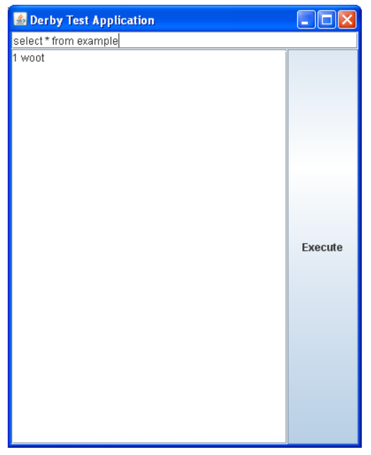

# Kapcsolat az adatbázissal #
Kliens-szerver architektúra kiváló különböző adatbázisok eléréséhez:
*Java DataBase Connectivity*. Ez egy szabványos API, `java.sql.*` (*Core API*),
`javax.sql.*` (*Extension*) csomagokban definiált osztályok (v.ö. ODBC).

A szolgáltatások három csoportba sorolhatók:

* Kapcsolódás a DB-hez
* Utasítások végrehajtása
* Eredmény lekérdezése

A DB elérhető natívan is (kétrétegű modell), de az API három rétegű: egy
absztrakt szint bevezetésével leválaszthatók a DB-specifikus dolgok, a
kommunikáció a JDBC-n keresztül történik.

## Meghajtóprogramok ##
Minden kapcsolathoz szükséges a hozzá tartozó meghajtóprogram betöltése, amely
kezeli a kapcsolatot, megoldja a hívások értelmezését és kiszolgálását (változó,
hogy milyenek vannak, pl. Oracle fizetős, MySQL ingyenes). Minden ilyen osztály
a `Driver` interfészt implementálja. A futtatáshoz kell a megfelelő meghajtó
*jar* fájl is, pl.:

	$ java -cp .;lib/mysql.jar MyMySQLTestClass

Nem kötelező kézzel betölteni, ha több DB-t is támogat a programunk,
használhatjuk a `DriverManager` osztályt, amely megpróbálja betölteni az éppen
aktuálisan használt DB-hez a megfelelő meghajtóprogramot.

A kapcsolat a DB-vel a `Connection` osztályon keresztül történik (egyszerre több
kapcsolat is fenntartható, ez a DB beállításától függő érték). Ezt egy URL-ben
kell megadni, amely a következő formátummal rendelkezik:

	jdbc:alprotokoll:adatforrás_leírása

Ahol:

* maga a protokoll a `jdbc`
* az alprotokoll megegyezik a forgalmazó nevével
* az adatforrás leírása pedig tartalmazhatja a DB szerver címét (*host:port*),
  az adattábla nevét, és tartalmazhatja a felhasználó nevét, jelszavát

**Itt a gyakon egy egyszerű, minimális DB kezelőt, a Derby-t fogjuk használni (*"Java DB is a free, fast, robust, full-featured pure Java database that fits in a 2.5MB JAR file, blah-blah-buzzword-blah-blah)"*.**
Elérhető az alábbi címen: <http://www.oracle.com/technetwork/java/javadb/overview/index.html>.
Ehhez a következő osztály dinamikus betöltésére van szükség (ő implementálja a
`Driver` interfészt):

	Class.forName("org.apache.derby.jdbc.EmbeddedDriver");

A driverek specifikáció szerint osztálybetöltéskor egy statikus inicializátor
blokkban bejegyzik magukat a `DriverManager` osztályban, így rendelkezésre
állnak. A kapcsolat kiépítéséhez a következő URL-t használhatjuk:

	jdbc:derby:[//host:port//]<dbName>[properties]

Ahol a `properties` tartalmazhatja a következő információkat (ezeket `;`
karakterekkel választhatjuk el):

* `create=true` Megpróbálja létrehozni a DB-t, ha még nincs. Adattáblákat nem
  csinál.
* `user=userName` DB felhasználó neve.
* `password=userPassword` DB felhasználó jelszava.
* `shutdown=true`

Példa a használatára:

	Connection dbConnection = null;
	String strUrl = "jdbc:derby:DefaultAddressBook;user=dbuser;password=dbuserpwd";
	try {
	    dbConnection = DriverManager.getConnection(strUrl);
	} catch (SQLException e) {
	    e.printStackTrace();
	}

Másik megoldás (kicsit biztonságosabb), ha property-kbe rakjuk a felhasználó
nevét és jelszavát:

	Connection dbConnection = null;
	String strUrl = "jdbc:derby:DefaultAddressBook";
	
	Properties props = new Properties();
	props.put("user", "dbuser");
	props.put("password", "dbuserpwd");
	try {
	    dbConnection = DriverManager.getConnection(strUrl, props);
	} catch(SQLException sqle) {
	    sqle.printStackTrace();
	}

Hova kerul a DB? A `derby.system.home` system property által beállított érték
határozza meg. Ezt vagy kódból lehet beállítani:

	System.setProperty("derby.system.home", "/tmp");

vagy futtatásnál lehet megadni:

	$ java -cp .;lib/mysql.jar -Dderby.system.home="/tmp" MyDerbyTestClass

**Ezt a kapcsolatot is ugyanúgy le kell zárni, mint a streameket. És nem, nem a `finalize()` függvényben!!**
A kapcsolatról rengeteg hasznos információ elkérhető a `getMetaData()`
függvényhívással.

## Tranzakciókezelés ##
Tranzakciókezelés támogatott (csak olyan SQL utasítás hajtható végre, amelynek
eredményét vagy véglegesítjük a DB-ben (*commit*), vagy visszavonunk minden
változtatást (*rollback*)). Ez alapból be van kapcsolva, aki kikapcsolja vagy
tudja, hogy mit csinál, vagy vessen magára.

## JDBC - Java type mapping ##

TODO: táblázat

## Utasítások végrehajtása ##

Három lehetőség:

* `Statement`: egyszerű SQL utasításokhoz. **Gyakon csak ez.**
* `PreparedStatement`: bemenő paramétereket tartalmazó, előfordított SQL
  utasításokhoz.
* `CallableStatement`: bemenő, kimenő paramétereket tartalmazó, tárolt eljárások
  hívásához.

## Statement végrehajtása ##
* `execute(String)`: tetszőleges utasításhoz, pl. tábla létrehozása (az
  áttekinthetőség érdekében a `String` literál lezáró `"` jeleket és a
  konkatenációt elhagytam):

		String strCreateTable = "CREATE TABLE inventory
		(
		   id INT PRIMARY KEY,
		   product VARCHAR(50),
		   quantity INT,
		   price DECIMAL
		)";
		
		statement = dbConnection.createStatement();
		statement.execute(strCreateTable);

* `executeQuery(String)`: lekérdezéshez, az eredmény egy `ResultSet` objektum
  lesz. %Mindig olvassátok végig az eredményt, mert addig nem záródik. Pl.:
  
		ResultSet rs = statement.executeQuery("SELECT * FROM inventory");
		while (rs.next()) {
		    String p = rs.getString("product");
		    int q = rs.getInt("quantity");
		    double d = rs.getDouble("price");
		    ...
		}

* `executeUpdate(String)`: insert, update, delete, és adatdefiníciós
  utasításokhoz, az eredmény a módosított sorok száma (vagy 0). Pl.:

		statement.executeUpdate("DELETE WHERE id=0");

## Kötegelt végrehajtás ##
Van rá lehtőség, hogy parancsokat összefogjunk, és egyszerre küldjünk el a
szervernek feldolgozásra, így sok kis adatmódosító utasítás gyorsabban lefuthat,
mintha külön-külön futtatgatnánk le őket. Pl.:

	statement.addBatch("Create TABLE ...");
	statement.addBatch("INSERT INTO ...");
	statement.addBatch("INSERT INTO ...");
	statement.addBatch("INSERT INTO ...");
	...
	statement.executeBatch();

Az `executeBatch()` egy tömbbel tér vissza, hogy az egyes utasítások hány sort
változtattak a DB-ben (itt `[0, 1, 1, 1, ...]` lesz).

> **Részletesen**
> 
> * <http://download.oracle.com/javase/tutorial/jdbc/index.html>
> * <http://www.jdbc-tutorial.com/>
> * <http://java.sun.com/developer/technicalArticles/J2SE/Desktop/javadb/>

## Feladat ##
Készítsetek egy egyszerű adatbázis kezelő grafikus felületet, amely az alábbi
ábrán látható! A program tartalmazzon egy `JTextField` komponenst, ahol a
lekérdezést lehet megadni, egy `JTextArea` komponenst, ahol megjeleníti az
eredményt, valamint egy gombot, amivel le lehet futtatni a megadott SQL
utasítást.

**Képernyőkép** - A program grafikus szerkezete

* A megvalósításhoz használjátok a következő címen elérhető `derby.jar` fájlt:
  <http://people.inf.elte.hu/legendi/java/res/derby.jar>
* A program az aktuális könyvtár alá, egy `derby` könyvtárba tegye az adatbázis
  fájlokat!
* Egy statikus inicializáló blokkban próbáljuk meg betölteni a szükséges
  meghajtó osztályt! Ha ez nem megy, termináljon a program.
* Az utasítás végrehajtásához használjátok az `execute(String sql)` függvényt!
* Az eredmény objektum bejárásánál elég, ha az elemeket a `getString(int)`
  metódussal írjátok ki. Ehhez tudnotok kell, hogy hány oszlop található az
  eredményben, ezt a `ResultSet#getMetaData()` függvényen keresztül elért
  objektumtól tudjátok lekérdezni.
